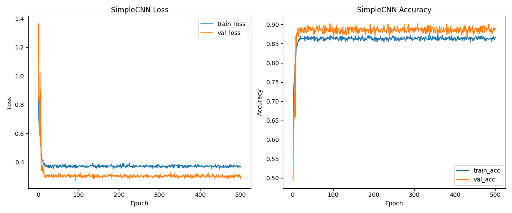
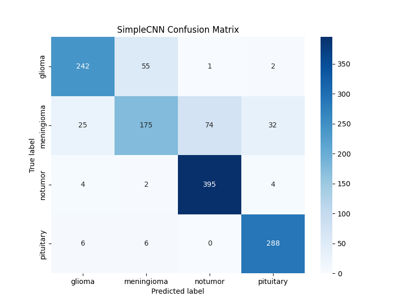

# 5 Custom DL Models for Brain Tumor Classification using PyTorch

This repository contains an **five customize deep learning models** for **brain tumor classification** implemented in **PyTorch**. For classifying brain tumor MRI images into 4 categories:

- **Glioma**
- **Meningioma**
- **Pituitary**
- **No Tumor**

---

## 🚀 Implementaed Features

- 📂 **Automatic dataset loading** from `Training/` and `Testing/` directories using `torchvision.datasets.ImageFolder`.
- 🖼 **Data augmentation & preprocessing** with random flips, rotations, crops, and normalization.
- 🧑‍🔬 **5 custom deep learning architectures** (from scratch):
  - ✅ `SimpleCNN`
  - ✅ `VGGLite`
  - ✅ `ResNetLite`
  - ✅ `SimpleDenseNetLite`
  - ✅ `MobileNetLite`
    
- ⚡ **Training & Validation** with:
  - GPU/CPU support  
  - Learning rate scheduling  
  - Best checkpoint saving
   
- 📊 **Evaluation & Metrics**:
  - Accuracy, Precision, Recall, F1-score
  - Confusion Matrix (raw + normalized)
  - Classification Reports
    
- 📈 **Visualization**:
  - Training curves (loss/accuracy)
  - Confusion matrix heatmaps
  - Sample predictions
    
- 💾 **Automatic saving**:
  - Trained models (`.pt`)
  - Training history (`.csv`)
  - Metrics reports (`.txt` / `.json`)
  - Plots (`.png`)

---

## 📂 Project Structure

```
.
├── BT.py                      # Python implemented codes
├── Training/                  # Training dataset (Image format)
├── Testing/                   # Testing dataset (Image format)
├── results_brain_tumor/       # Outputs (models, plots, reports)
│   ├── SimpleCNN_best.pt
│   ├── VGGLike_best.pt
│   ├── ResNetLike_best.pt
│   ├── ...
│   ├── *_history.csv
│   ├── *_history.png
│   ├── *_cm.png
│   ├── *_classification_report.txt
│   ├── summary_results.json
```

---

## ⚙️ Installation

Clone the repo and install dependencies:

```bash
git clone https://github.com/PanchananNath/Brain_Tumor_Detection_Using_DL_Models.git
cd brain-tumor-classification
pip install -r requirements.txt
```

### Requirements
- Python 3.8+
- PyTorch
- torchvision
- scikit-learn
- seaborn
- matplotlib
- tqdm

---

## 📊 Dataset Setup

Prepare dataset folders in the following format:

```
DATA_DIR/
│── Training/
│   ├── glioma/
│   ├── meningioma/
│   ├── pituitary/
│   └── notumor/
│
└── Testing/
    ├── glioma/
    ├── meningioma/
    ├── pituitary/
    └── notumor/
```

Update the dataset path in **BT.py**:
```python
DATA_DIR = "./"   # path containing Training/ and Testing/
```

---

## ▶️ Usage

Run the training & evaluation script:

```bash
python BT.py
```

By default:
- **Epochs:** 500  
- **Batch Size:** 32  
- **Image Size:** 224x224  
- **Optimizer:** Adam  
- **Learning Rate:** 1e-3  

---

## 📈 Results & Outputs

- **Training Curves:**  
  

- **Confusion Matrix (Example):**  
  

- **Sample Predictions:**  
  

- **Summary JSON:**  
  ```json
  {
    "SimpleCNN": {"test_accuracy": 0.89},
    "VGGLike": {"test_accuracy": 0.91},
    "ResNetLike": {"test_accuracy": 0.93},
    "SimpleDenseNetLike": {"test_accuracy": 0.92},
    "MobileNetLite": {"test_accuracy": 0.90}
  }
  ```

---

## 🧩 Models Implemented

1. **SimpleCNN** – Classic 3-block CNN with dropout-based classifier.  
2. **VGGLite** – Inspired by VGG16 but lighter, with sequential conv blocks.  
3. **ResNetLite** – Residual blocks for deeper representation.  
4. **SimpleDenseNetLite** – Dense connections (mini DenseNet style).  
5. **MobileNetLite** – Lightweight model using depthwise separable convolutions.  

---

## 🧪 Evaluation Metrics

- Accuracy  
- Precision / Recall / F1-score (per class)  
- Confusion Matrix (raw + normalized)  
- Classification Report (per class and macro/weighted averages)

---

## 🏆 Best Model

The script automatically selects the **best performing model on test accuracy** and visualizes predictions.


---

## 📜 License

This project is licensed under the **MIT License**.  
